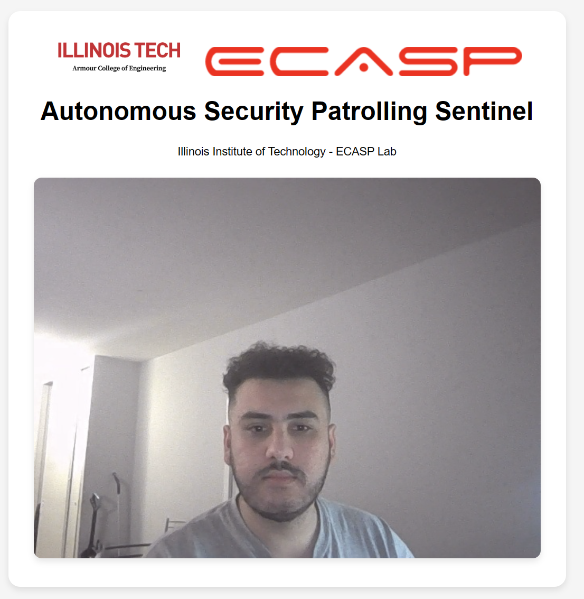

# robot-camera-web-viewer
[](https://github.com/smart-security-robot/robot-camera-web-viewer/actions/workflows/docker-image.yml)
A flask app to stream a camera of choice through a webapp




## Prerequisites

- [Python](https://www.python.org/downloads/)
- [Docker](https://www.docker.com/get-started) (if you plan to run the app in a container)

## Getting Started

### Running the app locally

1. Clone this repository:
        ```
        git clone 'https://github.com/smart-security-robot/robot-camera-web-viewer'
        ```

2. Navigate to the project's root directory:
        ```
        cd robot-camera-web-viewer
        ```

3. Install the dependencies:
        ```
        pip install -r requirements.txt
        ```

4. Run the app:
        ```
        python app.py
        ```

5. Open http://localhost:5000 in a web browser.

### Running the app in a Docker container

1. Build the Docker image:
        ```
        docker build -t robot-camera-web-viewer .
        ```

2. Run the Docker container (Linux Only):
        ```
        docker run -p 5000:5000 --device=/dev/video0:/dev/video0 robot-camera-web-viewer
        ```

3. Open http://localhost:5000 in a web browser.


## License

This project is licensed under the MIT License - see the [LICENSE.md](LICENSE.md) file for details.
